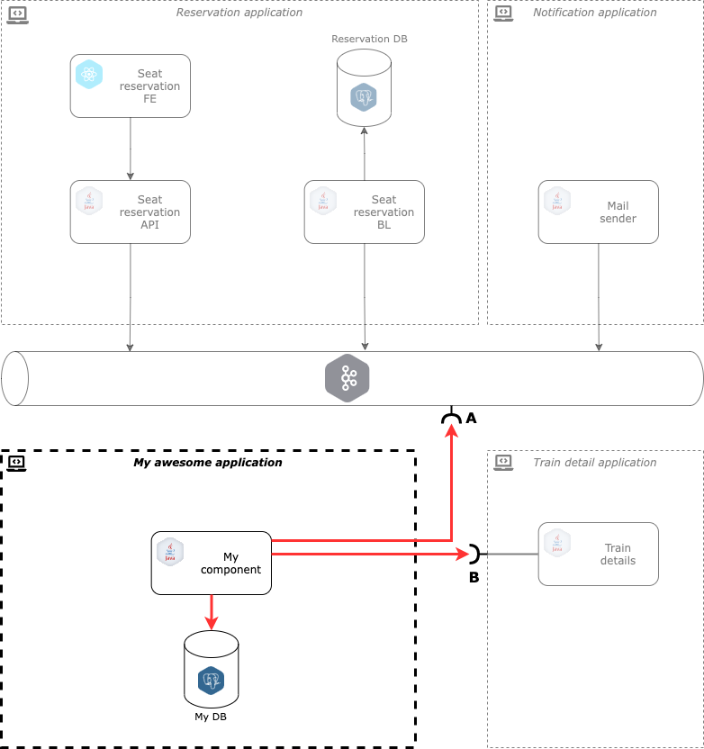

## Reservation application

### Git link
```shell
git clone git@github.com:StratoxEnterprises/tyden-inovaci-workshop.git
```

### Deployment model



**A**:
  - DEV environment
    - Kafka: TBD
    - Topic: TBD
  - PROD environment
    - Kafka: TBD
    - Topic: TBD

**B**:
  - DEV environment
    - Url: TBD
  - PROD environment
    - Url: TBD

### Local development

#### Kafka image

```
git clone https://github.com/StratoxEnterprises/oxus-docker-kafka-dev
docker-compose up -d
docker exec -it oxus-docker-kafka-dev_kafka_1 /opt/bitnami/kafka/bin/kafka-console-producer.sh --bootstrap-server localhost:9092 --topic new-reservation
```

Message:
```
{"firstName":"xxx","lastName":"xxx","email":"xxx@xxx.cz","seatId":"1-10","trainId":"ICE-575","date":1634031630989}
```

### Code snippets

#### Reservation warehouse entity

```java
TBD
```

#### Reservation storage

```java
TBD
```

#### Reservation storage configuration

```yaml
TBD
```

#### Kafka topic subscriber

```java
TBD
```

#### Kafka subscriber configuration

```yaml
TBD
```
